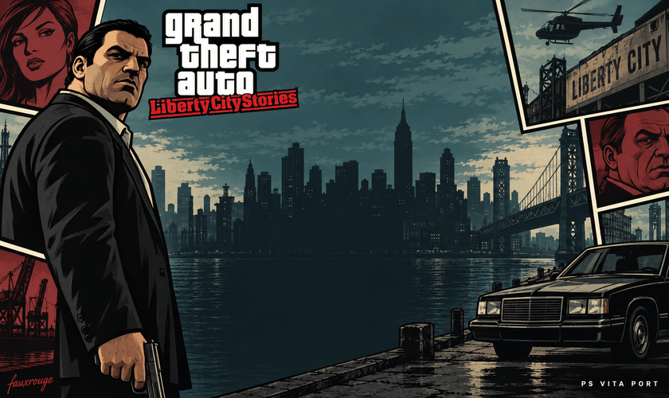

<p align="center">
  
</p>

<h1 align="center">Liberty City Stories for PS Vita</h1>

<p align="center">
  A native port by <a href="https://github.com/fauxrougee">fauxrouge</a>, built on <a href="https://github.com/knackers4/res">reStories</a>.
</p>

<p align="center">
  <a href="https://github.com/fauxrougee/GTALCS-psvita-port/releases/latest"></a>
  
</p>

<p align="center">
  <a href="https://github.com/fauxrougee/GTALCS-psvita-port/releases/latest">Download</a> &middot;
  <a href="#install">Installation</a> &middot;
  <a href="#troubleshooting">Troubleshooting</a> &middot;
  <a href="vita/README.md">Build from source</a>
</p>

## Before you start

You will need:

- A PS Vita with homebrew support and [VitaShell](https://github.com/TheOfficialFloW/VitaShell/releases).
- Your own **PS2 copy of GTA: Liberty City Stories** and a Windows PC to convert its files.
- The Vita shader compiler, `libshacccg.suprx`. If it is missing, install it with [ShaRKBR33D](https://github.com/Rinnegatamante/ShaRKBR33D).

The VPK includes the port and the full intro with sound. The files needed to play the game come from your PS2 copy.

## Install

### 1. Convert the game files

On your PC, download the [reLCS Asset Converter](https://github.com/knackers4/res/releases/download/relcs/reLCSAssetConverter.exe) from the original reStories project. Use it to convert the game files from your PS2 copy and let the conversion finish.

Keep the entire converted game folder. You will need its data, models, textures, text, and audio folders.

### 2. Copy the data to your Vita

Connect through VitaShell using USB or FTP. Create this folder:

```text
ux0:data/reLCS/
```

Copy the **contents** of the converted game folder into it. Keep the folder names and structure from the converter. For example:

```text
ux0:data/reLCS/
  AUDIO/
  DATA/
  TEXT/
  models/
    gta3.img
  ...the rest of the converted files and folders
```

Check that `gta3.img` is at **`ux0:data/reLCS/models/gta3.img`**. An extra folder such as `reLCS/assets/models/` will prevent the game from finding it.

### 3. Install the VPK

Download [**reLCS 01.18 with the full intro**](https://github.com/fauxrougee/GTALCS-psvita-port/releases/download/v01.18/reLCS-01.18-intro-complete.vpk) (163 MB).

Copy the `.vpk` to your Vita, open it in VitaShell, and install it. The ZIP files labeled *Source code* on the release page are for developers.

### 4. Play

Open the **GTA Liberty City Stories** bubble and select **START**. You can skip the intro with **Cross** or **Start**. After the intro, allow the game to finish loading the menu.

## Updating

Install the new VPK over the existing version. Keep `ux0:data/reLCS/` in place, including your saves. Working game data does not need to be converted again for 01.18.

Version 01.18 fixes D-pad left during gameplay and restores its missing binding in older settings automatically. There is no need to delete your settings files. Existing custom bindings are kept.

Version 01.17 creates the `userfiles` folder automatically and reports failed saves correctly. Existing saves keep the same filenames and format. A save that 01.16 reported as successful without creating a file cannot be recovered.

The upcoming **01.19** build adds an **UPDATE** tile to the game's LiveArea.
Close the game, then select it to open **GTA LCS Update**. It is part of the
game and opens only through this tile; there is no additional home-screen
bubble or plugin. It checks the latest compatible GitHub release, asks before
downloading, and installs the complete VPK while keeping your game data,
saves, and settings. **Circle** cancels a download, and selecting Update
again resumes it. Keep about **550 MB free** and leave the Vita powered on
during installation.

After installation, close the game's LiveArea page and select **START** to
launch the updated version. If you installed the earlier test build's
separate **GTA LCS Update** bubble, you can delete that bubble; keep the game.

Install the first version with this feature through VitaShell. Subsequent
compatible releases can be installed from the LiveArea. This feature is
still awaiting a complete console test; 01.18 remains the published release.
If an update fails, attach `ux0:data/reLCS/update.log`. The
[updater notes](vita/updater/README.md) explain how releases are prepared.

## Troubleshooting

For cheat codes, use the LCS PSP or PS2 combinations with **L/R** in place of
**L1/R1**. See the [Vita cheat guide](docs/CHEATS.md) for examples and supported
effects in the upcoming 01.19 build.

<details>
<summary><strong>The intro plays, but the game does not reach the menu</strong></summary>

Check `ux0:data/reLCS/models/gta3.img` and make sure you copied all the converted folders. The intro is included in the VPK, so it can play even when the game data is missing.

Also check that the shader compiler exists at either:

- `ur0:data/libshacccg.suprx`
- `ur0:data/external/libshacccg.suprx`

If both checks look right, attach `ux0:data/reLCS/log.txt` to a bug report.

</details>

<details>
<summary><strong>The intro is missing or crashes</strong></summary>

Install the VPK linked above, which includes the full video and sound. If the problem continues, attach `ux0:data/reLCS/intro.log` to a bug report.

</details>

<details>
<summary><strong>The frame rate drops</strong></summary>

Performance depends on the area and what is happening on screen. The software 30 FPS cap is removed, but this is not a locked 60 FPS release. The port requests its CPU and GPU clocks at startup; there is no separate overclocking step in this guide.

For a performance report, include the location or mission, what was happening, and `ux0:data/reLCS/log.txt` from that session.

</details>

Still stuck? [Open an issue](https://github.com/fauxrougee/GTALCS-psvita-port/issues/new/choose) with your version, Vita model, and the steps that trigger the problem. Copy the logs before launching the game again, as each launch replaces them.

## Development

Want to build the port or work on it? Start with the [build guide](vita/README.md), then see [contributing](CONTRIBUTING.md) and the [test commands](docs/DEVELOPMENT.md). The [01.16 renderer notes](docs/VITA-PERFORMANCE.md) explain the changes and their validation limits.

## Thanks

This port builds on **[reStories / reLCS](https://github.com/knackers4/res)**, **[librw](https://github.com/aap/librw)**, **[vitaGL](https://github.com/Rinnegatamante/vitaGL)**, and **[VitaSDK](https://vitasdk.org/)**. Thanks to the people behind these projects and the Vita homebrew tools that make ports like this possible.

[Full credits and licenses](docs/CREDITS.md). GTA: Liberty City Stories belongs to its respective rights holders; this is an unofficial port.
